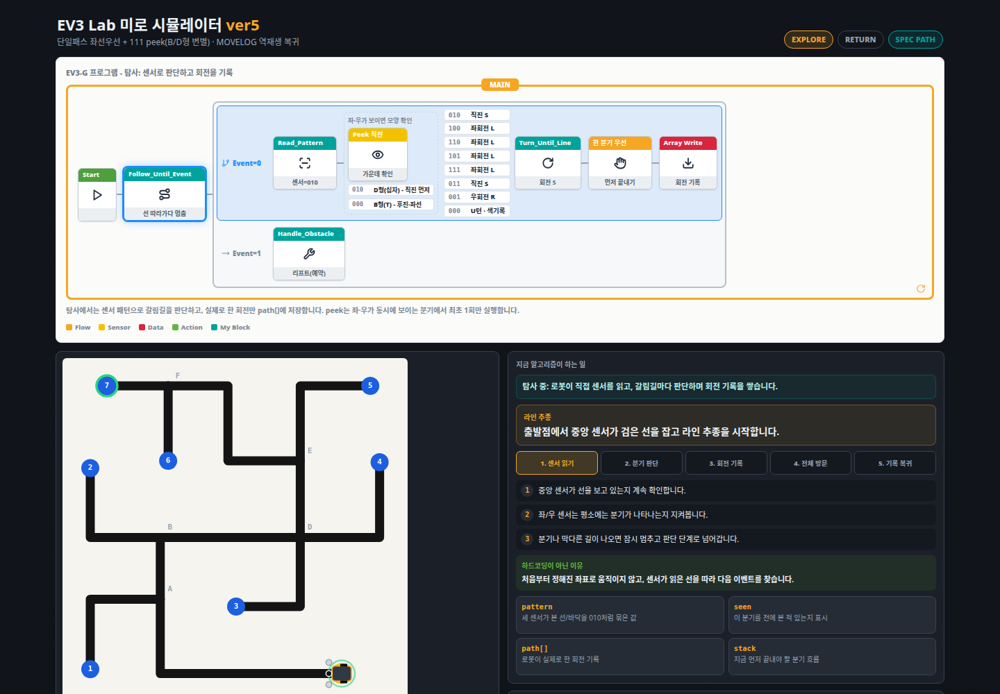

# EV3 Maze

[https://ev3sim.vercel.app/](https://ev3sim.vercel.app/)



EV3 미로 라인트레이서 프로젝트입니다. 브라우저에서 알고리즘 흐름을 확인하는
React 시뮬레이터와, ev3dev-stretch에서 실행하는 Python 로봇 프로그램을 함께 둡니다.

- EXPLORE: 좌선우선, 111 peek, 한 분기 우선 규칙으로 모든 노드를 지나 7에 도착
- RETURN: MOVELOG를 역순 + 좌우 반전으로 재생해 0으로 복귀
- ROBOT: 컬러센서 3개와 초음파 센서로 분기를 읽고 물체를 집어 도착점에 내려놓음
- 배포: Vercel 기본 빌드, GitHub Pages용 `/ev3maze/` base 빌드 지원

## Web

```bash
npm install
npm run dev
```

```bash
npm run test:logic
npm run build
```

## Robot

```bash
python3 robot/main.py --dry-run
python3 -m py_compile robot/*.py
python3 robot/tests/sim_maze.py
```

VS Code의 ev3dev-browser 확장에서 `EV3: run maze` 실행 구성을 사용할 수 있습니다.

## Files

- `EV3Sim.jsx`: 원본 단일 파일 구현 참고본
- `미로_알고리즘_구현명세.md`: 알고리즘 기준 명세
- `src/`: 배포 가능한 Vite + React 앱
- `maze.png`: 원본 미로 참고 이미지
- `robot/`: ev3dev-stretch에서 실행할 Python 로봇 코드
